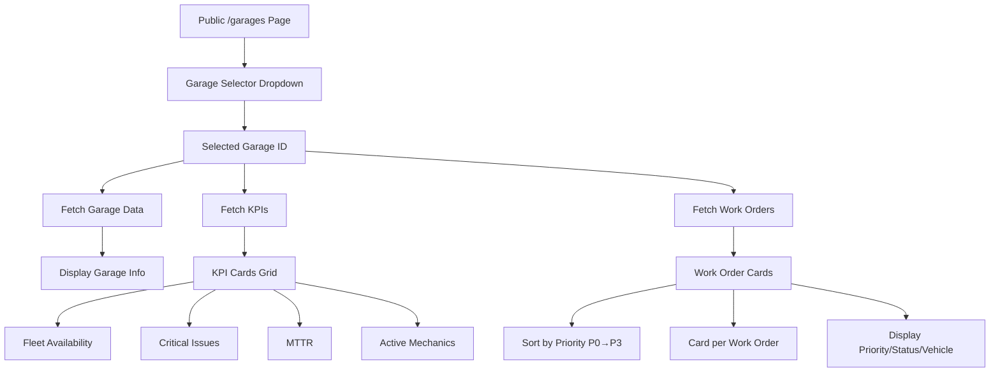

# Public Garage Dashboard Implementation

## Overview

Create a public-facing garage dashboard page accessible without authentication at `/garages`. The page will display real-time KPIs and work orders for selected garages, allowing stakeholders to track fleet status and maintenance needs.

## Architecture

## Implementation Steps

### 1. Create Public Route Structure

- **File**: `app/garages/page.tsx`
  - Public route (no authentication required)
  - Server component for initial data fetch
  - Client component wrapper for interactivity

### 2. Database: RLS Policies for Public Read Access

- **File**: `db/migrations/010_public_garage_access.sql`
  - Create RLS policies to allow anonymous/public read access to:
    - `garages` table (all rows)
    - `vehicles` table (filtered by garage_id)
    - `work_orders` table (filtered by garage_id via vehicle relationship)
    - `mechanics` table (for active mechanics count)
  - Use `SELECT` policies with `TO anon` role
  - Ensure work orders are accessible via vehicle → garage relationship

### 3. Public Garage Dashboard Component

- **File**: `app/garages/page.tsx`
  - Garage selector dropdown (load all garages)
  - Default to first garage or "All Garages" option
  - Display garage name and address
  - KPI cards grid (4 cards matching ops dashboard)
  - Work orders section with priority-sorted cards

### 4. Reuse KPI Logic

- **File**: `lib/hooks/usePublicGarageDashboard.ts` (new)
  - Extract and adapt `useRealtimeDashboard` logic for public access
  - Use anonymous Supabase client (no auth required)
  - Fetch vehicles, work orders, mechanics filtered by garage_id
  - Calculate same metrics: availability, MTTR, critical issues, active mechanics
  - Support real-time subscriptions for live updates

### 5. Work Order Cards Component

- **File**: `components/features/work-orders/PublicWorkOrderCard.tsx` (new)
  - Display work order as card with:
    - Priority badge (P0-P3 with color coding)
    - Title and description
    - Vehicle information (VIN, make/model)
    - Status badge
    - Type (Preventive/Repair)
    - Issue type (if available)
  - Sort by priority: P0 → P1 → P2 → P3
  - Within same priority, sort by created_at (newest first)

### 6. KPI Cards Component

- **File**: `components/features/dashboard/PublicKPICards.tsx` (new)
  - Reuse KPI card design from ops dashboard
  - Display: Fleet Availability %, Critical Issues count, MTTR, Active Mechanics
  - Same visual styling as ops dashboard for consistency

### 7. Middleware Update

- **File**: `middleware.ts`
  - Ensure `/garages` route is NOT protected (already public by default)
  - No changes needed if route doesn't match protected patterns

### 8. Styling

- Use same design system as ops dashboard
- Professional, clean layout suitable for public display
- Responsive grid layout
- Dark mode support (if applicable)

## Data Flow

1. **Page Load**: Fetch all garages, default to first garage
2. **Garage Selection**: Update selected garage_id, refetch all data
3. **Real-time Updates**: Subscribe to vehicle and work_order changes for selected garage
4. **KPI Calculation**: Compute metrics from fetched data (same logic as ops dashboard)
5. **Work Order Display**: Filter work orders by garage (via vehicle relationship), sort by priority

## Security Considerations

- RLS policies restrict public access to read-only operations
- Only garage-scoped data is accessible (no cross-garage data leakage)
- No sensitive information exposed (no user details, costs, etc.)
- Work orders filtered by garage via vehicle relationship

## Files to Create/Modify

### New Files

- `app/garages/page.tsx` - Main public garage dashboard page
- `lib/hooks/usePublicGarageDashboard.ts` - Public dashboard data hook
- `components/features/work-orders/PublicWorkOrderCard.tsx` - Work order card component
- `components/features/dashboard/PublicKPICards.tsx` - KPI cards component
- `db/migrations/010_public_garage_access.sql` - RLS policies for public access

### Modified Files

- `middleware.ts` - Verify `/garages` is not protected (likely no changes needed)
- `types/index.ts` - Add any new types if needed for public dashboard

## Testing Considerations

- Verify public access works without authentication
- Test garage selector functionality
- Verify KPI calculations match ops dashboard
- Test work order sorting (P0 → P3)
- Test real-time updates
- Verify RLS policies prevent unauthorized access
- Test with multiple garages

## Success Criteria

- Public users can access `/garages` without login
- Garage selector allows switching between garages
- All 4 KPI cards display correct metrics
- Work orders display as cards sorted by priority
- Real-time updates work for public users
- No sensitive data is exposed
- Page is responsive and visually consistent with ops dashboard